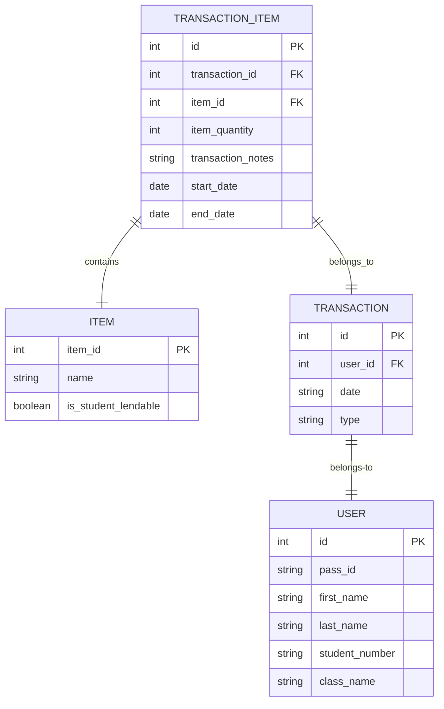

# Software Design Document: Inventory Management System

## Database Schema

This schema is coming soon and is made with [Mermaid](https://mermaid.js.org/syntax/entityRelationshipDiagram.html)

```mermaid
erDiagram
    TRANSACTION_ITEM ||--|| ITEM : contains
    TRANSACTION_ITEM ||--|| TRANSACTION : belongs_to
    TRANSACTION ||--|| USER : belongs-to

    USER {
        int id PK
        string pass_id
        string first_name
        string last_name
        string student_number
        string class_name
    }

    ITEM {
        int item_id PK
        string name
        boolean is_student_lendable
    }

    TRANSACTION_ITEM{
        int id PK
        int transaction_id FK
        int item_id FK
        int item_quantity
        string transaction_notes
        date start_date
        date end_date
    }

    TRANSACTION{
        int id PK
        int user_id FK
        string date
        string type
    }
```
